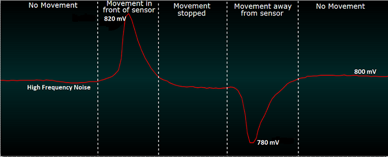
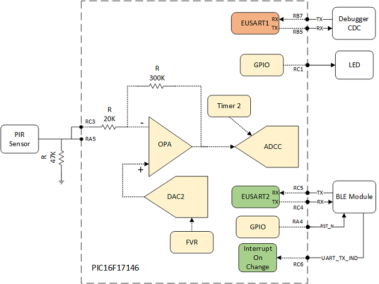

# PIR Sensor Node with BLE using PIC16F17146

## Overview
This example can be divided into 2 parts – PIR sensor interface and BLE communication.
Both of these parts are independent to each other meaning any choice of sensor can be used in place of PIR sensor. This document first covers overview of PIR sensor interface followed by BLE communication.

## Related Documentation
-	[PIC16F17146 Product Page](https://www.microchip.com/en-us/product/PIC16F17146?utm_source=GitHub&utm_medium=TextLink&utm_campaign=MCU8_PIC16F171xx&utm_content=pic16f17146-pir-sensor-node-with-ble-mplab-mcc-github&utm_bu=MCU08)
-	[PIC16F17146 Data Sheet](https://www.microchip.com/DS40002343)

## Software Used
- [MPLAB® X IDE 6.20 ](https://www.microchip.com/en-us/tools-resources/develop/mplab-x-ide?utm_source=GitHub&utm_medium=TextLink&utm_campaign=MCU8_PIC16F171xx&utm_content=pic16f17146-pir-sensor-node-with-ble-mplab-mcc-github&utm_bu=MCU08)or newer
- [Microchip XC8 Compiler 2.46](https://www.microchip.com/en-us/tools-resources/develop/mplab-xc-compilers?utm_source=GitHub&utm_medium=TextLink&utm_campaign=MCU8_PIC16F171xx&utm_content=pic16f17146-pir-sensor-node-with-ble-mplab-mcc-github&utm_bu=MCU08) or newer
- [MPLAB® Code Configurator (MCC) 5.1.9](https://www.microchip.com/en-us/tools-resources/configure/mplab-code-configurator?utm_source=GitHub&utm_medium=TextLink&utm_campaign=MCU8_PIC16F171xx&utm_content=pic16f17146-pir-sensor-node-with-ble-mplab-mcc-github&utm_bu=MCU08) or newer
-	[Microchip PIC16F1xxxx Series Device Support (DFP) 1.14.187](https://packs.download.microchip.com/)or newer
- [Microchip Bluetooth Data iOS® app 3.0](https://apps.apple.com/us/app/microchip-bluetooth-data/id1319166097) or newer
- [Microchip Bluetooth Data Android™ app 6.1 ](https://play.google.com/store/apps/details?id=com.microchip.bluetooth.data) or newer
- [RN4871 Firmware 1.41 ](https://www.microchip.com/product/RN4871)or newer

## Hardware Used
-	[PIC16F17146 Curiosity Nano Board](https://www.microchip.com/en-us/development-tool/EV72J15A?utm_source=GitHub&utm_medium=TextLink&utm_campaign=MCU8_PIC16F171xx&utm_content=pic16f17146-pir-sensor-node-with-ble-mplab-mcc-github&utm_bu=MCU08)
-	[Curiosity Nano Base Board](https://www.microchip.com/development-tool/AC164162)
-	[RN4871 Click Board](https://www.mikroe.com/rn4871-click)
- [PIR Click Board](https://www.mikroe.com/pir-click)

## PIR Sensor Interface
This example aims to simplify Passive Infrared Sensor (PIR) interface to a Microcontroller (MCU) using intelligent analog peripherals such as Operational Amplifier (OPA), Analog-to-Digital converter with computation (ADCC), Digital-to-Analog converter (DAC),Fixed Voltage Reference (FVR), and core independent peripherals (CIP) such as the Timer of PIC16F17146 MCU. The use of intelligent and core independent peripherals makes it possible to interface a PIR sensor with minimal external components and minimal CPU intervention. Minimal CPU intervention enables the opportunity of operating the MCU in sleep mode for most of the time.

The output signal of the PIR sensor is amplified and digitally filtered to determine if the movement has occurred. The techniques used in this example can be also applied to other sensor interfaces where amplification of row sensor output and noise removal is required.

## PIR Sensor Overview
A PIR sensor detects changes in the amount of infrared radiation “seen” by the sensor elements, which varies depending on the temperature and surface characteristics of the object in front of the sensor. When a person passes between the sensor and the background, the sensor detects the change from ambient temperature to body temperature, and back again. The sensor converts the resulting change in the infrared radiation into a change in the output voltage.

### Analysis of PIR sensor output
The figure below shows a plot of the raw output of the PIR sensor captured using the oscilloscope. A hand is placed over the sensor and held there for a short time and then removed.

Below are the observations of above captured data:
- Voltage is around 800 mV during the normal condition (No movement).
- Voltage goes up to 820 mV when there is movement in front of the sensor.
- Voltage goes down to 780 mV before settling around 800 mV again.
- There is high frequency noise in the PIR signal as the signal is not smooth.

**Note:** There may be variations in output voltage levels from the sensor to sensor but the working principle of the sensor remains the same.  

### Implementation Details:
The following measures need to be taken to detect the change in PIR sensor output:
1. The sensor output needs to be amplified before being sampled by the ADC, as the change in output signal levels from the PIR sensor is very low.
2. The DC offset voltage present in the PIR signal at normal conditions needs to be removed before amplification.
3. High-frequency noise needs to be removed to avoid false detection when the noise level is high.

The first two measures stated above are addressed by using OPA and DAC peripherals. OPA is used in inverting amplifier mode. DAC output is applied at the non-inverting terminal of OPA to remove DC offset voltage. OPA uses an internal resistor ladder for providing the gain required for amplification. The FVR module provides stable voltage reference irrespective of supply voltage to the DAC. To remove unwanted high-frequency noise from the PIR signal, ADCC is used in the Low Pass Filter (LPF) mode. ADCC is triggered periodically using Timer 2. ADCC’s threshold interrupts feature is used to generate an interrupt whenever there is a change in output.

### Amplification and DC bias removal

As observed previously, the PIR signal is at 800 mV in normal conditions. There is a change of 20 mV to 100 mV when movement is detected. To remove the DC bias of 800 mV and to amplify only change, OPA can be used in difference amplifier mode as shown in the below figure.

For above circuit, output can be given as,

`output=(-R2/R1)(PIR voltage - DC bias voltage)`

As the OPA uses a single supply, extra DC bias voltage needs to be applied at the non-inverting terminal to shift the signal up. Voltage is shifted to Vdd/2 in order to cover the maximum output range.

Extra DC bias voltage required can be calculated as,

`(Vdd ⁄ 2)/(R2 ⁄ R1)`

Thus, total DC voltage needs to be applied is,

`0.8 V + (Vdd ⁄ 2)/(R2 ⁄R1)`

Thus,

`Output =  -R2/R1 * (PIR voltage - 0.8 - (Vdd ⁄ 2)/(R2 ⁄ R1))`

`Output=  Vdd/2 - (PIR voltage - 0.8) * R2/R1`

From the above equation, it is noticeable that, 0.8 V (PIR offset voltage) is removed from the PIR signal and then the signal is amplified by the gain set by R2 and R1. The resulting signal deviates around Vdd/2 covering the maximum output range.

The OPA module of PIC16F17146 has an internal resistor ladder which can be used at inverting terminal of OPA for this application. At the non-inverting terminal, DC voltage can be applied directly using the DAC module without any resistors. The DC voltage needs to be set by considering the voltage divider formed by the resistor (R1 and R2).

For this application, R1 and R2 are set as 20k and 300k respectively which leads to a gain of 15. Thus, the voltage required to apply at the non-inverting terminal without any resistors is,

`(0.8 + (Vdd ⁄ 2)/(R2 ⁄ R1)) * R2 / (R2+R1) = (0.8 + 1.65 / 15)* 300 / 320 = 0.853V`

DAC2 is used to generate 853 mV and its output is connected to OPA’s non-inverting terminal internally. Finally, the circuit will look as shown below.

The below figure shows the output of OPA.

The change in the PIR signal is amplified. The OPA output is inverted as the PIR signal is connected to inverting terminal of OPA. When there is no movement, the output is around 1.65 V (Vdd/2).

**Note:** Above simulation is generated using [MPLAB® Mindi™ Analog Simulator](https://www.microchip.com/tools-resources/develop/analog-development-tool-ecosystem/mplab-mindi-analog-simulator). Mindi model for PIC16F17146's OPA is available [here](https://github.com/microchip-pic-avr-examples?q=pic16f17146-opamp-mindi).

### Noise cancellation
The PIR signal has high-frequency noise. The ADCC’s LPF is used to remove unwanted high frequency components of the signal. The LPF is a single-pole, unity gain digital filter and is one of the computation features of the ADCC. The ADCRS value determines the -3 dB roll-off frequency. The table below shows the radian values at the -3 dB roll-off frequency based on ADCRS values.

The radian values listed in the table above are defined by the ADCC hardware. These values are used to calculate the -3 dB roll-off point in terms of frequency. The following equation can be used to determine the -3 dB point.

`Frequency @ -3dB = (Radians @ - 3dB) / 2πT`

Where: 
Radians @ -3 dB = the value from the above table based on the ADCRS value. 
T = total sampling time. It is the measured time between samples.

For detailed operation of ADCC LPF, refer to [AN2479](https://www.microchip.com/DS00002749).

For this example, ADCRS is set as 6.

To set the cutoff frequency to 3 Hz, T should be around 840 us. (Cutoff frequency of 3 Hz is set to match RC low pass filter cutoff frequency present on the click board)
Timer 2 is used to trigger the ADCC in every 840 us.

The below figure shows the output of ADCC. It can be observed that, there is a change in output values whenever the hand is moved across the PIR sensor.

**Note:** The ADCC data is sent to PC using EUSART and plotted by using the Data Stream protocol in the [Data Visualizer](https://www.microchip.com/en-us/tools-resources/debug/mplab-data-visualizer). The figure is for reference and firmware does not include data streaming instructions. For detailed information on Data Visualizer, refer to the [Data Visualizer User's Guide](https://www.microchip.com/DS50003001)

### Sleep Mode Operation and ADCC Threshold Interrupt
In this example, the ADCC threshold interrupt is used to generate an interrupt whenever there is a change in ADCC output. The threshold comparison is performed on the final filtered value. When there is a change in filtered output by the amount set by the ADCC threshold value, it indicates that movement has been detected. Various operations can be performed on ADCC output to generate a threshold interrupt. Please refer device dataset for details.

In this example, ADCC is configured in a way that, ADCC generates an interrupt when ADCC filtered value goes below some predefined value (lower threshold) and thus indicating movement is detected. The threshold value ultimately determines the sensitivity of the sensor. Higher is the threshold value lower is the sensitivity and vice versa.  

To perform movement detection in sleep mode, ADCC and TMR2 which is used to trigger ADCC, should run even if MCU is in sleep mode.  ADCC can run in sleep mode by using the ADCRC clock. TMR2 can also be made to operate in sleep by using LFINTOS as its clock source.  

After movement is detected, MCU wakes up due to a lower threshold interrupt. Once woke up, MCU disables the lower threshold interrupt and enables the upper threshold. Then MCU goes to sleep again. An upper threshold limit is set to generate an interrupt when PIR output stabilizes at a normal value (PIR output when there is no movement). Thus, when there is no movement, MCU wakes up due to an upper threshold interrupt. Once woke up, MCU disables the upper threshold interrupt and enables a lower threshold. This process continues.

When movement is detected, MCU turns on the LED for five seconds. The MCU goes to sleep immediately after turning on the LED. TMR0 generates an interrupt after five seconds to turn off the LED. This period can be changed as per application need.  

## RN4871 BLE Module Interface
RN4871 communicates with the host controller using ASCII commands over the UART interface. RN4871 acts as a peripheral device and the smartphone acts as a central device throughout this application.

In this example, whenever movement is detected by the PIR sensor, a message is sent to the smartphone. Also, PIR sensitivity can be updated by sending data from the smartphone to the BLE module.

As mentioned previously, MCU operates most of the time in sleep mode. The BLE module’s UART_TX_IND pin is used to wake the MCU up to receive an incoming message from the BLE module. UART_TX_IND pin goes low before RN4871 sends data over UART. MCU is configured to generate an interrupt thus by waking up MCU when the UART_TX_IND line goes low.  

## BLE Communication

### Transparent UART
This example uses a private GATT service named “Transparent UART” introduced by the RN4871 software stack. Transparent UART transfers serial data from its UART over a Bluetooth Low Energy connection, providing an end-to-end data pipe to another Bluetooth Device.

Refer to [RN4870/71 Bluetooth Low Energy Module User’s Guide](https://www.microchip.com/DS50002466) for details.

### Smartphone App
This example uses the “Microchip Bluetooth Data (MBD)” app for the demonstration. BLE UART feature of the app scans and connect the BLE device (RN4871 module in this case). The App displays data received from the device on-screen and transfers text typed in the app to a BLE device.

Visit [Bluetooth® Low Energy webpage](https://www.microchip.com/en-us/products/wireless-connectivity/bluetooth-low-energy) for app link and source code.

**Note:** Some of the RN4871 factory settings have been changed before interfacing with PIC16F17146. Using the S-command, the device name has been changed to “Sensor_Node”. Also, the UART communication settings have been configured to 9600,8,N,1.

## Hardware Setup
The below image shows the hardware setup. PIC16F17146 Curiosity Nano board is used as a development platform in this example. Curiosity nano base board is used for connecting click boards to the Nano board.

#### Hardware modifications on PIR Click:
The PIR click board is used for demonstration purposes. The Click board needs to be modified before it can be used for this example. The original click board has an external amplification and filter stage implemented using OPA and passive components which is shown in the figure below.

For this example, no external components are required (except a 47k resistor at the output of sensor which is recommended by the sensor datasheet). The R11 resistor from the click board is removed and PIR output (VOUT) is directly connected (green cable in “Hardware Setup” image) to the one of the NC pins (RST in this case) pin of the mikroBUS header to bypass the amplification and filter stage.

#### Hardware modifications on RN4871 Click:
RN4871 click does not provide the connection for RN4871’s UART_TX_IND pin on the mikroBUS header. Thus, a wire is explicitly soldered to connect UART_TX_IND pin (pin 15 – P2_7) and one of the NC pins (SCK is this case) of mikroBUS header. AN2 is then used as the UART_TX_IND pin.  

**Note:** Mode switch on RN4871 click board should be set to 0 in order to put RN4871 in Application mode.

## Hardware Connection

## Pin Connection Table

| Pin | Signal Description                    
| --- | -------------------                
| RC3	| OPA Negative Channel2
| RA5 | PIR output2,3
| RC1	| LED
| RC4	| EUSART2 RX1
| RC5	| EUSART2 TX1
| RC6	| RN4871 UART_TX_IND
| RA4	| RN4871 RST_N1
| RB5	| EUSART1 RX
| RB7	| EUSART1 TX

1 Connection from PIC16F17146 curiosity nano to click slot is not available for these pins. Jumper cables are used to make the required connections. For RN4871 TX pin, short **RX2** and **MISO** of Curiosity Nano Base Board. For RN4871 RX pin, short **TX2**, and **MOSI**. For RN4871 RST_N pin, short **RST2** and **INT1**.

2 OPA negative channel is not available for pin RA5. A jumper cable is used to connect PIR output(**RA5**) to OPA negative channel(**RC3**).

3Pin RA5 should be in tri-state to avoid any interference with PIR output.

## Demo Operation
1. When the device is powered on, the LED blinks for 5 sec before turning off. The 5 sec is the warm-up time set for this example. This is a one-time process. There should not be any movement around the sensor during this time.
2. Whenever movement is detected, the PIR sensor output goes below the threshold value. The LED turns on to indicate the movement. It stays on for 5 sec before turning off. This process repeats whenever movement is detected. Also, a message is sent to the smartphone if a BLE connection is available.

3. Whenever there is no movement, the LED remains in the off state.
4. The sensitivity of the PIR sensor can be updated by sending sensitivity values (0 to 10) from the smartphone app. MCU acknowledges if it receives updated sensitivity by sending messages back to the smartphone app.

#### Steps to connect RN4871 BLE Module to Smartphone
1. Install and open the app Microchip Bluetooth Data.
2. Click on BLE UART.
3. Click on BM70.
4. Click on Scan. If a pop-up message appears to turn on Bluetooth, click Yes and then click Scan again.
5. Click the Scan tab to list the devices.
6. Wait for the scan for 4-5 seconds, and then click Cancel to cancel the scan.
7. Note: After canceling the scan, the Bluetooth module name (Sensor_Node in this case), should be listed on the screen. If the name is not listed, go to Step 4 and repeat the scan.
8. Click on the BLE Module name.
9. Wait for the connection.
10. Click on Transfer data to the device to open the UART stream. Now data sent by RN4871 can be observed and data can be sent to RN4871.

## Peripheral Configuration using MCC
This section explains how to configure the peripherals using MPLAB X IDE with MCC plug-in to recreate the project.

Refer [Software Used](https://github.com/microchip-pic-avr-examples/pic16f17146-pir-sensor-node-with-ble-mplab-mcc#software-used) section to install required tools to recreate the project.

Additional Links: [MCC Melody Technical Reference](https://onlinedocs.microchip.com/v2/keyword-lookup?keyword=MCC.MELODY.INTRODUCTION&redirect=true)

|    Module  |    Configuration                                                                                                                                                                                                                                                                                                                                                       |    Usage                                                                   |
|--------------------------------|----------------------------------------------------------------------------------------------------------------------------------------------------------------------------------------------------------------------------------------------------------------------------------------------------------------------------------------------------------------------------|--------------------------------------------------------------------------------|
|    Clock Control           |    *Clock Settings* Clock Source – HFINTOSC    HF Internal Clock – 1 MHz    Clock Divider – 1                                                                   |    System clock   
|    OPA                    |   *Hardware Settings*  Enable Op Amp    Op Amp   Configuration – Inverting Programmable Gain Amplifier  *Channel Selection* Positive Channel – DAC2_OUT Negative Channel – GSEL Negative Source Selection – OPA1IN1-     *Programmable Gain and Feedback Selection*  Internal Resistor Ladder selection – R2/R1 = 15        |    Amplifies PIR output      |
|    DAC2                    |  *Hardware Settings*   Enable DAC    DAC Positive reference selection – FVR    DAC Negative reference selection – VSS  |    Connects to OPA non-inverting terminal. Provides bias voltage                                    |    
|    FVR                    |   *Hardware Settings*  Enable FVR    FVR_buffer 1 Gain – off    FVR_buffer 2 Gain – 2x       |    Provides reference voltage to DAC                                           |                                 
|    ADCC                    |   *Software Settings*  TMR Dependecy Selector - TMR2  *Hardware Settings* Enable ADCC    Input   Configuration- Single Ended Mode  Positive   Reference – VDD Auto-conversion Trigger – TMR2 Result   Alignment – Right justified   *Computation Settings*  Operating   Mode – Low Pass Filter Mode  Error Calculation Mode – Filtered value vs setpoint    Threshold setpoint – 0  Threshold Interrupt Mode – ADERR < ADLTH   Repeat – 64   Accumulator Right Shift – 6    *ADC Clock settings*   Clock Source – ADCRC     *Interrupt Settings* ADTI Interrupt Enable|    Monitors OPA output                                          |
|    TMR2                    |   *Software Settings*  Dependency Selector – TMR2   *Hardware Settings* Disable Timer Control Mode – Roll over pulse Start/Reset Option – Software control  *Timer Clock*  Clock Source – LFINTOSC   Prescaler – 1:1   Postscaler – 1:1   *Timer Period*   Timer Period – 840 us         |    Triggers ADCC                                                      |
|   TMR0  |   *Hardware Settings*  Disable Timer    Clock Prescaler  – 1:1024  Clock Source – LFINTOSC Disable   Synchronisation         Requested   Period – 5s   *Interrupt Settings*   Enable TMR Interrupt|    Provides time to turn off the LED                                  |
|  EUSART1  |  *UART1 Driver* Requested Baudrate –   9600   UART PLIB Selector – EUSART1 Enable Redirect   STDIO to EUSART    *EUSART1 PLIB*  Enable Receive   Enable Transmit  Enable Serial   Port                                                                                                                                                                                              |    Sends data to   PC terminal                                              |
|    EUSART2                 |    *UART2 Driver* Requested Baudrate –   9600   UART PLIB Selector – EUSART2   Enable Interrupt Driven  Enable Redirect   STDIO to EUSART     *EUSART2 PLIB:*       Enable   Receive   Enable Transmit   *Interrupt Settings*   Enable RCI interrupt                                                                                                                                                                                            |    Communicates with BLE module                                              |

**Note:** The on-board debugger present on curiosity Nano board has a virtual serial port (CDC) that is connected to a Universal Asynchronous Receiver/Transmitter (UART) on the PIC16F17146 and provides an easy way to communicate with the target application through terminal software. Refer curiosity Nano user guide for more details.

## Summary
This code example demonstrated interfacing of a passive infrared (PIR) sensor with BLE connectivity using various peripherals of PIC16F17146 microcontroller.
